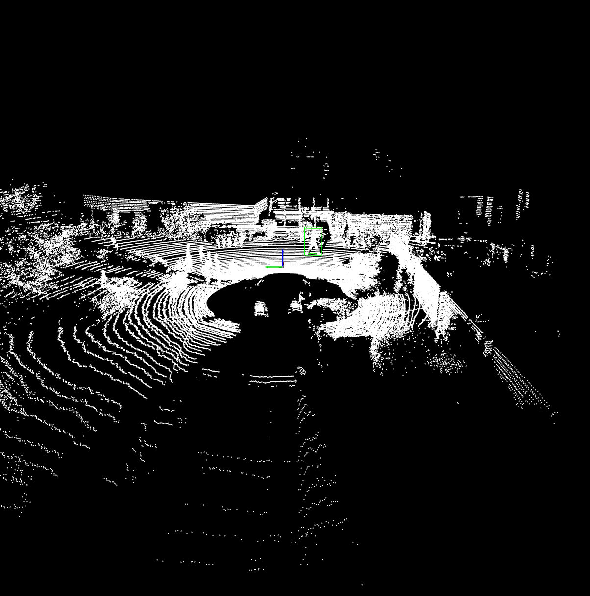
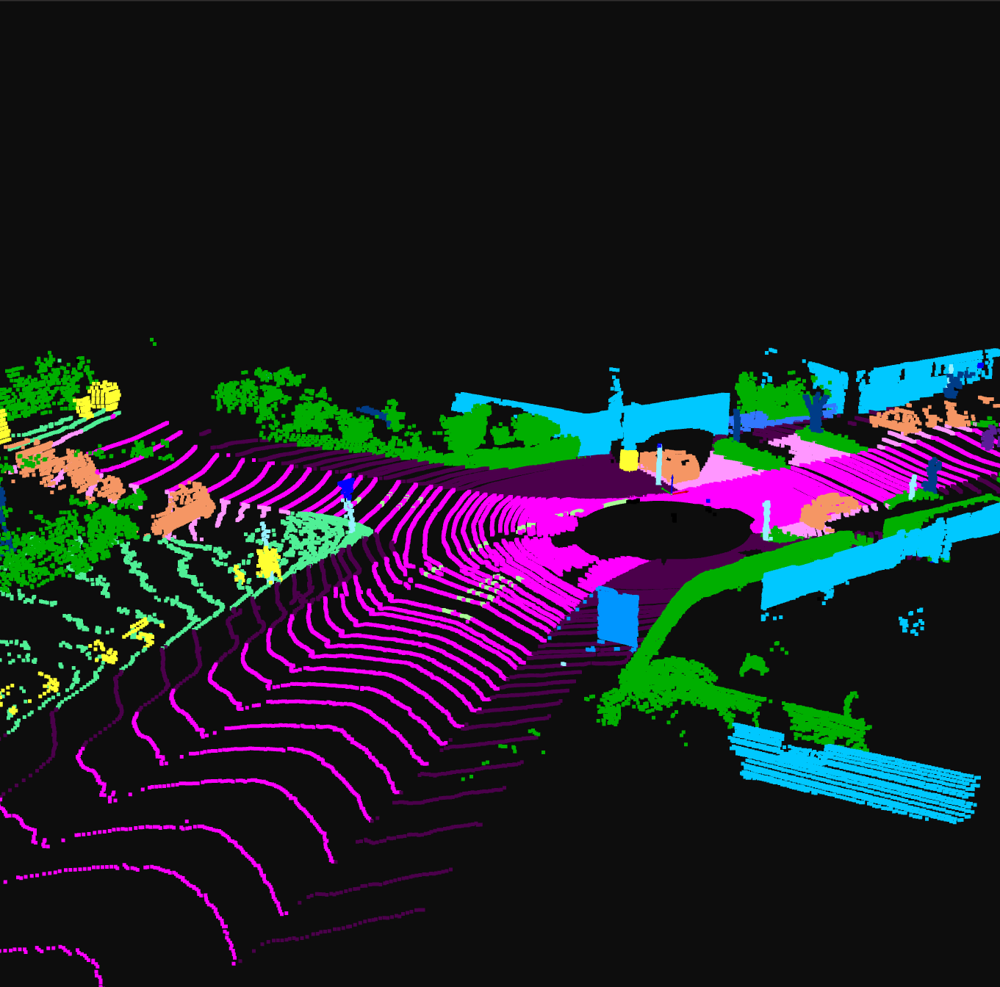
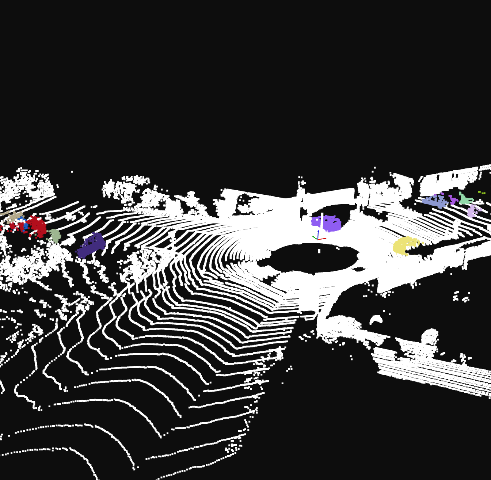
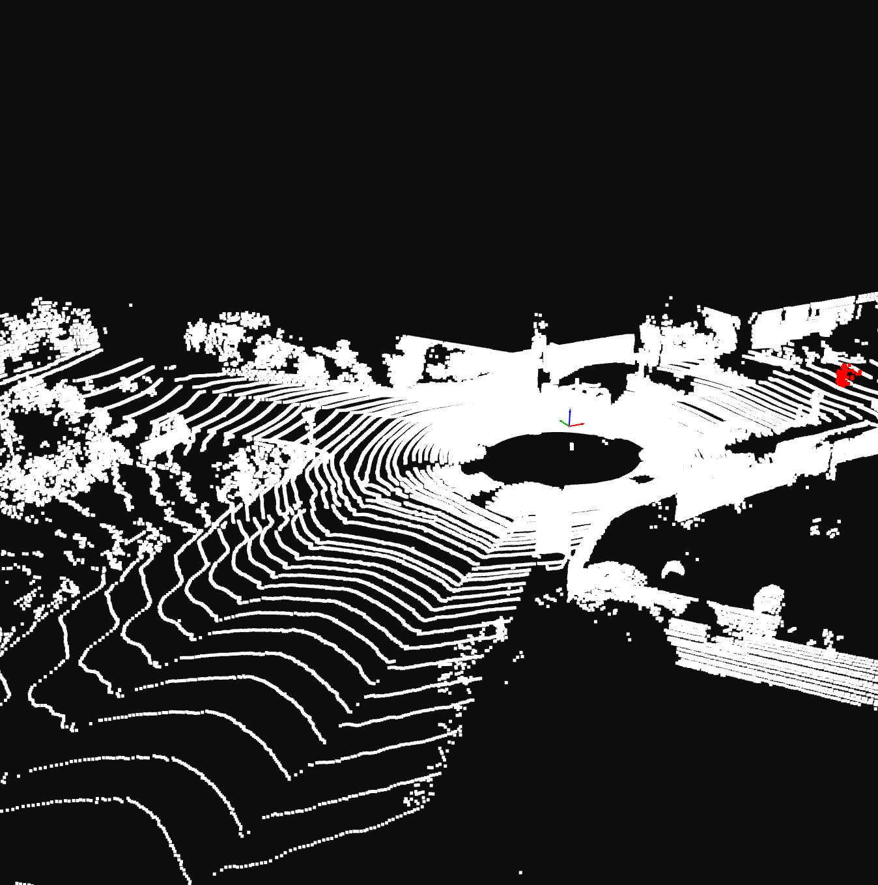
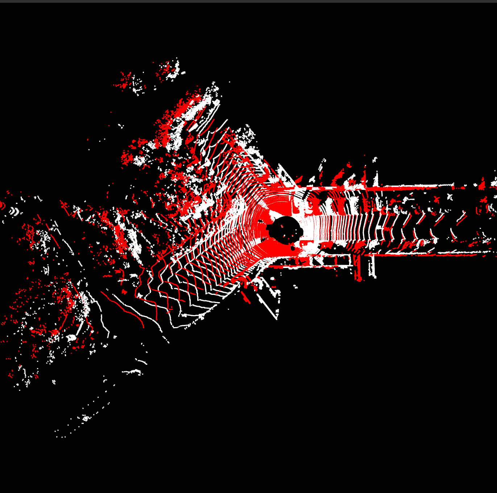
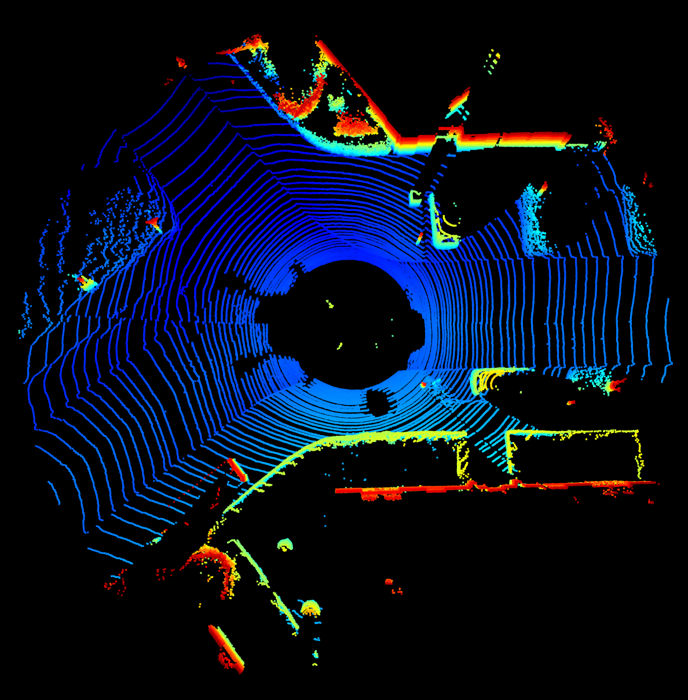
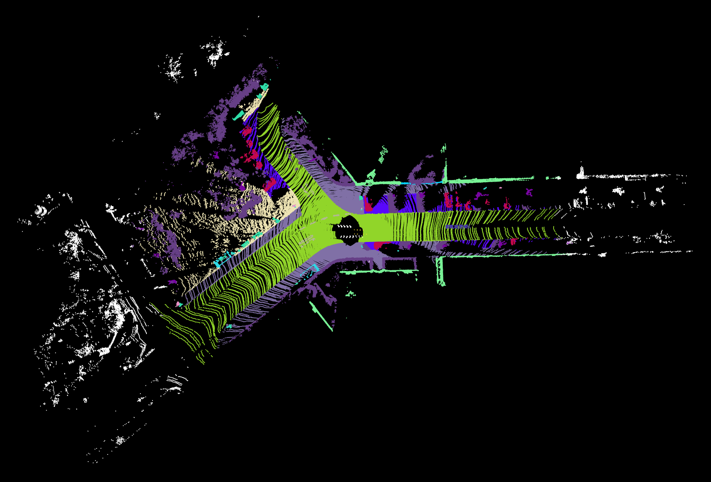
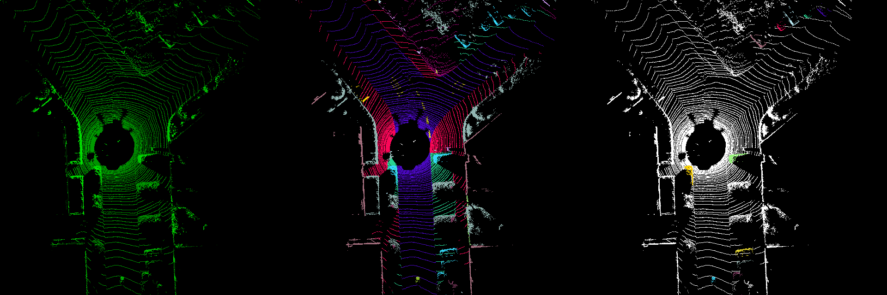

This is an useful toolbox for the developers who need to process the point cloud collected by various types of sensors like LiDAR.

# Dependencies
- python
- numpy
- open3d
- opencv
```bash
pip install open3d
pip install numpy
pip install opencv-contrib-python
```

# Usage

```bash
python tutorial.py
```

`tutorial.py` contains several functions, you can comment/uncomment different functions to run the corresponding demos. Here are the functions:
- `vis_sequential_object()`  will read the configs and visualize the point cloud with OBB(Oriented Bounding Boxes) in a **blocking** manner (the non-blocking program is still under developing)
	- `N`: Next Frame
	- `B`: Previous Frame


- `vis_sequential_sem_inst_motion()`  will read the configs and visualize the point cloud with Semantic/Instance/Motion labels in a **non-blocking** manner 
	- `N`: Next Frame
	- `B`: Previous Frame
	- `S`: Semantic Mode
	- `I`: Instance Mode
	- `M`: Motion Mode







- `test_visualizer()`  contains various kinds of visualizations, you can dive into it.


- `test_dataloader_visualizer()`  contains dataloader that can load point cloud from `.bin` or `.pcd`


- `test_kitti_mapper()` reads the `poses.txt`, `calib.txt`,`*.bin`,`*.label` and build a dense map


- `test_bev()` convert the point cloud to BEV(Bird's Eye View) image


# Developing

The functions of this toolbox include:
- [ ] dataloader
	- [x] load xyz from `*.bin`
	- [x] load xyzi from `*.bin`
	- [x] load xyzi and crop to certain ROI from `*.bin`
	- [x] load semantic/instance label from `*.label`
	- [x] load xyz from `*.pcd`
	- [x] load xyz and downsize from `*.pcd`
	- [x] load xyzi from `*.pcd`
	- [x] load xyzi and downsize from `*.pcd`
- [ ] visualize single frame data
	- [x] visualize point cloud $[n,3]$ 
	- [x] visualize point cloud with label $[n,3]$ + $[n,1]$
	- [ ] ……
- [ ] visualize sequential data
	- [x] semantic segmentation
	- [x] instance segmentation
	- [x] moving object segmentation
	- [x] object detection blocking
	- [ ] object detection non-blocking
- [ ] mapping with sequential data and poses
	- [x] mapping with kitti-like data
- [ ] visualize kitti point cloud map
- [x] lidar-bev transform


# Contribute

https://github.com/chaomath/open3d-kitti-visualization
https://github.com/PRBonn/semantic-kitti-api
https://github.com/yknapp/lidar2bev

